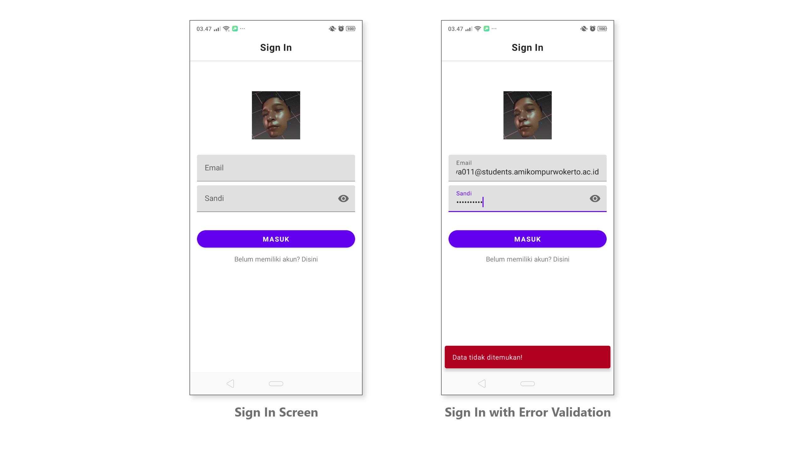
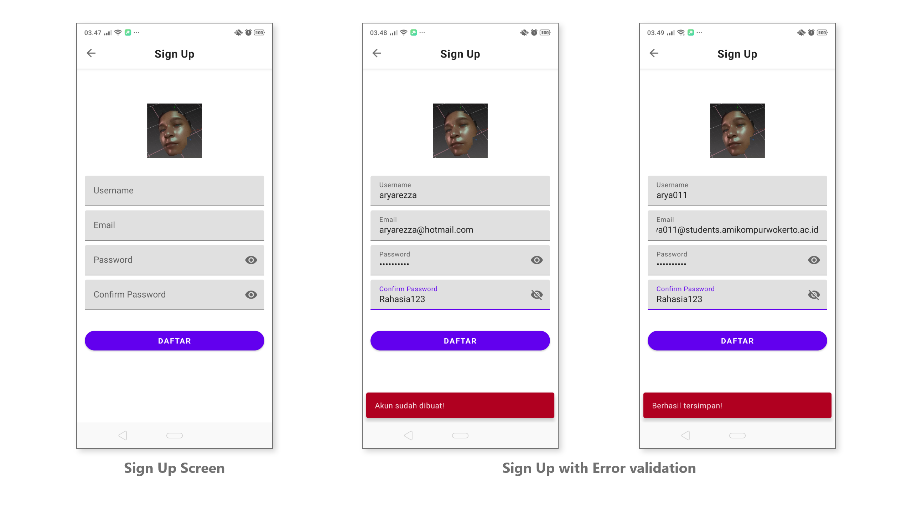
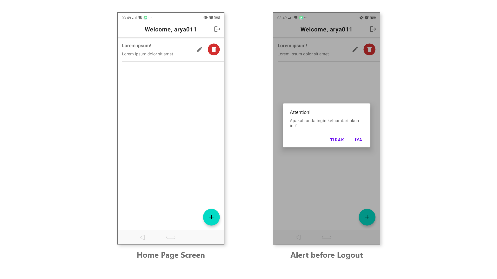
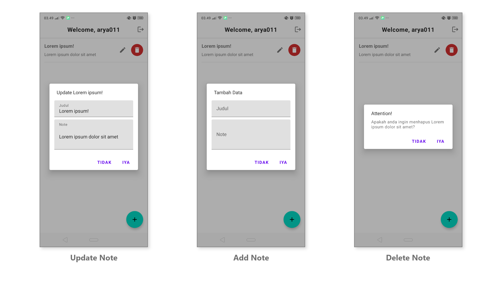

# Binar ExerciseProject Chapter 4
Hello 🚀
### Racikan tambahan
- ROOM
- Shared Preferences
- View Model
- Coroutine
- Navigation Component
- Lifecycle Component
- Recycler View + Diffutils
- **MVVM Based**
- Material Design Based
### Gif

### Screenshoot aplikasi

